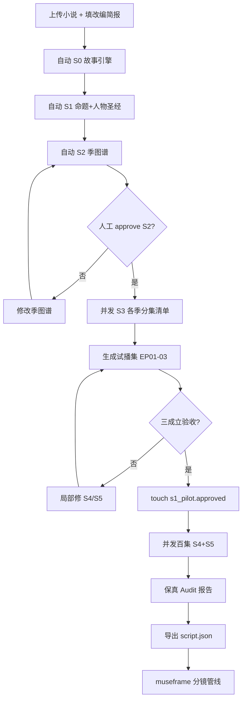

# PRD · NovelScript Engine

**产品名称**：NovelScript Engine（小说精编 → AI 漫剧剧本引擎）  
**文档版本**：v1.2.0  
**状态**：评审通过 · 可进入开发冻结  
**最后更新**：2026-07-06  
**关联文档**：[TECH_PLAN.md](../TECH_PLAN.md) · [README.md](../README.md)

---

## 文档修订记录

| 版本 | 日期 | 作者 | 变更摘要 |
|------|------|------|----------|
| v1.0.0-draft | 2026-07-06 | 产品/工程联合起草 | 首版 PRD，整合 S0–S5 方法论、百集规模、三阶段改编模式路线图 |
| v1.1.0 | 2026-07-06 | 评审修订 | 闭合 MVP/Full Scale 分层；修正 S2/S3 映射阶段；对齐手工样板字段；补充 Gate3/Schema/目录规范 |
| v1.2.0 | 2026-07-06 | 二轮修订 | 补全 EP01 fixture；修复 beat schema；S5 scene_id 回填规则；HITL 命名统一 |

---

## 1. 执行摘要

### 1.1 产品定位

NovelScript Engine 是一套**面向百集级长篇网文 IP 的 AI 漫剧剧本精编引擎**。它将小说原文转化为**结构化、可校验、可局部重跑、可交棒下游分镜/视频管线**的场次级漫剧剧本，而非一次性生成的不可维护 prose。

本产品在整体 AI 漫剧生产链路中的位置：

```
小说原文 + 改编策略
    → [NovelScript Engine] 宏观编剧精编（S0–S5）
    → museframe / 分镜管线（镜号/景别/15s 切分/视频）
    → 成片
```

### 1.2 核心价值主张

| 对比维度 | 通用 LLM 一次性改编 | NovelScript Engine |
|----------|---------------------|-------------------|
| 输出形态 | 不可维护的长文本 | Markdown + JSON Schema 结构化资产 |
| 长篇一致性 | 角色/设定漂移 | 事件图谱 + 人物圣经 + 来源索引 |
| 失败恢复 | 全量重跑 | 阶段级缓存 + 集级并发 + 局部修复 |
| 质量保障 | 依赖 prompt 自觉 | 三层 Gate（机考 / LLM Review / 保真 Audit）|
| 规模上限 | ~10 集实用 | **100+ 集工程化设计目标** |
| 改编深度 | 单一「压缩改写」| 可扩展多模式改编策略（见 §4）|

### 1.3 成功标准（Dragon's Ice 验证集）

基准项目：`dragon_ice_132.txt`（131 章 → 5 季 / ~120 集）。

#### MVP 范围（W1–W8，开发冻结边界）

1. S0–S2 全书级产物自动生成；S2 经人工 `approved/S2.approved` 后结构稳定。
2. **S1 季内** 26 集 S4+S5 自动产出；试播集 EP01–03 人工验收「三成立」（见 §5.3.2 rubric）。
3. **S1 季内**（Ch1–30）属于本季的必保名场面子集，100% 映射到具体 `episode_id` 与 `scene_id`。
4. EP01–03 的 `script.json` 通过 `schemas/museframe_scene.v1.json` 校验；端到端分镜可生成。
5. 单集失败可独立重跑，不影响已 `approved` 集次。
6. 全链路生成日志可审计（prompt / checker / review / 模型版本）。

#### Full Scale 退出标准（MVP 之后，SCALE-01 验收）

- 5 季合计 ~120 集 S3–S5 全量跑通。
- 全部 14 个必保名场面 100% 映射到 `season_id` + `episode_id` + `scene_id`。
- 百集 S4+S5 全量生成 P95 总时长 < 12h（8 并发，不含人工 approve 等待）。
- 发布 `docs/cost_model.md` 实测预算报告。

---

## 2. 背景与问题陈述

### 2.1 行业背景

- 2026 年国内 AI 漫剧市场规模预计超 240 亿元；爆款内容 80%+ 来自网文 IP 改编。
- 现有开源工具（Toonflow、huobao-drama 等）侧重「剧本→成片」，**剧本精编层**普遍薄弱：缺乏分季结构、缺乏必保场面审计、缺乏百集级工程化。
- 单次大 prompt「读全书→吐剧本」在 30 集以上出现：结构漂移、角色混乱、无法局部修、失败即全废。

### 2.2 核心问题

1. **改编不是翻译**：小说叙事思维（心理描写、环境渲染）必须转为视听剧本思维（动作、对白、镜头暗示）。
2. **长篇需要宏观结构**：131 章平铺结构必须重组为「季命题 → 分集钩子 → 场次冲突」三级结构。
3. **质量需要可验证**：「好不好看」不能只靠人读，需要机考 + 审片人 + 原著保真三层门。
4. **规模需要工程化**：百集意味着并发、缓存、断点续跑、版本管理，不是写 100 次 prompt。

### 2.3 已验证的方法论（Dragon's Ice 手工样板）

`workspace_script/` 已完成 S0–S5 手工精品样板（EP01–03 试播集），验证了：

- **四台故事发动机**（逆袭 / 双男主拉扯 / 命定之恋 / 身世之谜）作为改编取舍裁决标准。
- **S2 季图谱**将 131 章重组为 5 季，每季「危机 → 选择 → 钩子」。
- **S5 场次剧本**含来源索引、场景目标/冲突/情绪弧线，可交棒 museframe。

本 PRD 目标：将手工方法论**产品化、自动化、可扩展**。

---

## 3. 目标用户与使用场景

### 3.1 目标用户

| 用户角色 | 核心诉求 | 使用深度 |
|----------|----------|----------|
| **编剧/改编策划** | 长篇 IP 分季分集、必保场面、人物弧光 | S0–S3 深度参与 + S4/S5 审改 |
| **AI 漫剧制作人** | 百集批量产出、质量稳定、交棒分镜 | 全自动 S4–S5 + 试播集验收 |
| **工程/平台开发** | 可集成 API、Schema 稳定、可审计 | JSON 契约 + pipeline API |
| **版权方/IP 方** | 改编忠实度可证明、授权边界清晰 | 保真 Audit 报告 + 改编模式选择 |

### 3.2 核心使用场景

**场景 A：单本百集改编（MVP）**  
输入：一本 100+ 章网文 + 改编简报 → 输出：5 季 × 20–30 集结构化漫剧剧本。

**场景 B：试播验证**  
先产 EP01–03，人工验收「三成立」后解锁批量生成，避免错误结构被放大。

**场景 C：局部修订**  
修改 S2 季断点后，仅重跑 S3 及之后；修改 EP07 剧本后，仅重跑 EP07。

**场景 D：下游交棒**  
`script.json` 直接进入 museframe `content_analysis → script_generate → segment_storyboard`。

### 3.3 非目标用户（Out of Scope for MVP）

- 不需要剧本精编、只要「一句话出成片」的纯 C 端创作者（推荐 huobao-drama 类工具）。
- 原创剧本从零写作（Scriptify 等工具更合适，本引擎 INPUT 假设有小说原文）。

---

## 4. 改编模式路线图

本产品采用**可插拔改编策略（Adaptation Strategy）**架构。MVP 实现模式 1；模式 2–4 在架构上预留扩展点，不阻塞 MVP 交付。

### 4.1 模式总览

| 模式 ID | 名称 | 忠实对象 | 结构处理 | 输入 | 优先级 |
|---------|------|----------|----------|------|--------|
| **M1** | 标准精编 | 原著情节体验 + 名场面 | 重组压缩，保留主线 | 单本小说 | **MVP** |
| **M2** | 深度改编 | 单本**核心体验 + 人物命题** | 情节可大幅重组，命题不可动 | 单本小说 + 命题锚点 | Phase 2 |
| **M3** | 多本改写 | **主书体验**为主轴 | 辅书素材服务主轴，合并角色/支线 | 主书 + 1..N 辅书 | Phase 3 |
| **M4** | 多本重构 | **目标类型承诺**（如甜宠/逆袭）| 素材池 → 原创故事骨架 | 多本素材池 + 类型模板 | Phase 4 |

### 4.2 模式 1：标准精编（MVP）

**定义**：忠于原著阅读体验与名场面，对情节进行重组、压缩、合并，服务竖屏短剧节奏。

**裁决标准**（已实现于 S0）：
- 四台故事发动机供能检查
- 14+ 必保名场面清单（`must_keep_scenes`）
- 配角合并方案（`character_bible` 合并表）
- 「更集中更锋利，而非仅仅更安全」

**Dragon's Ice 实例**：131 章 → 5 季 → S1 26 集，EP01 前置冲突、EP07 献丝带。

### 4.3 模式 2：深度改编（Phase 2）

**定义**：忠实于单本**核心体验与人物命题**，情节可大幅改写甚至重排时间线，但以下不可动：
- `series_premise` 一句话命题
- 主角「想要 / 不愿承认 / 会改变」三要素
- `story_engine` 定义的发动机与情感兑付终点

**新增阶段**（插入 S0 与 S1 之间）：
- **S0-C `experience_anchor`**：从原著冷拆解「读者真正追的是什么体验」（非情节摘要）。
- **S0-D `adaptation_freedom_map`**：标注每章/段落为 {必保 | 可压缩 | 可改写 | 可删除}。

**质量门增强**：
- 命题一致性检查：每场戏必须标注 `serves_premise: true/false`。
- 体验锚点覆盖：每个 `experience_anchor` 必须在全剧至少 2 个集次有体现。

### 4.4 模式 3：多本改写（Phase 3）

**定义**：以主书阅读体验为主轴，辅书提供素材（角色、桥段、世界观细节），服务主轴而非平行叙述。

**新增输入**：
```json
{
  "primary": {"novel_id": "book_a", "role": "主轴"},
  "secondary": [
    {"novel_id": "book_b", "role": "素材库", "usable_elements": ["角色", "桥段", "设定"]}
  ],
  "merge_policy": "辅书元素必须映射到主书某季/某引擎，不得独立成线"
}
```

**新增阶段**：
- **S0-M `material_inventory`**：跨书素材索引（角色/桥段/设定/名场面），带来源书标记。
- **S1-M `axis_merge_plan`**：哪些辅书素材并入哪一季/哪一引擎，何角色合并/替代。

**质量门增强**：
- 辅书元素必须有 `primary_axis_ref`（服务主轴的映射理由）。
- 禁止辅书独立季/独立结局（机考）。

### 4.5 模式 4：多本重构（Phase 4）

**定义**：忠实于**目标类型承诺**（如「甜宠逆袭」「双男主拉扯」），从多本素材池重新原创一个故事骨架，原著情节仅供参考。

**新增输入**：
```json
{
  "genre_contract": {
    "primary_genre": "奇幻言情",
    "emotion_curve": ["屈辱", "逆袭", "拉扯", "兑付", "决战"],
    "episode_spec": {"duration_sec": 120, "hook_sec": 15}
  },
  "material_pool": ["book_a", "book_b", "book_c"],
  "originality_level": "reconstruct"
}
```

**管线变化**：
- S0 产出 `genre_story_seed`（原创骨架）而非 `story_engine`（原著拆解）。
- S2 季图谱从类型节奏模板 + 素材池「借骨」生成，不追求章节覆盖。
- 保真 Audit 切换为「类型承诺 Audit」：检查情绪曲线、钩子密度、人物弧光，而非原著场面覆盖。

### 4.6 改编模式架构扩展点

```python
class AdaptationStrategy(Protocol):
    mode_id: str  # M1 | M2 | M3 | M4

    def input_manifest(self) -> InputManifest:
        """单书 | 主书+辅书 | 多书素材池；声明 rights_basis。"""

    def index_stages(self) -> list[StageDef]:
        """P0 索引层；M3 扩展 cross_book_entities / material_inventory。"""

    def s0_stages(self) -> list[StageDef]:
        """M1/M2: story_engine；M4: genre_story_seed 替代。"""

    def macro_stages(self) -> list[StageDef]:
        """S1–S2；M4 的 S2 输入改为 genre_contract + 素材池摘要。"""

    def micro_stages(self) -> list[StageDef]:
        """S3–S5，各模式共享。"""

    def checkers(self) -> dict[str, Checker]: ...

    def fidelity_audit(self) -> FidelityAuditor:
        """M1/M2: MustKeepAuditor；M3: +AxisMergeAuditor；M4: GenreContractAuditor。"""

    def context_for_episode(self, ep: EpisodeMeta) -> EpisodeContext: ...
```

**M3 存储扩展**（Phase 3 前冻结路径，MVP 仅占位目录）：
- `index/material_inventory.json` — 字段：`source_novel_id`, `element_type`, `primary_axis_ref`, `usable_in_seasons[]`
- Gate 1：`merge_policy` 违规（辅书独立季/独立结局）→ `hard_fail`

**M4 管线差异**：
- S0 产出 `genre_story_seed` 替代 `story_engine`
- S2 输入改为 `genre_contract` + 素材池摘要，不追求章节覆盖率
- Fidelity 切换为 `GenreContractAuditor`（情绪曲线、钩子密度、人物弧光）

MVP 仅实现 `StandardRefinementStrategy(M1)`；上述接口在 MVP 代码中提供空实现/占位，避免 Phase 2–4 重构核心管线。

---

## 5. 产品功能需求

### 5.1 功能架构总览

```
┌─────────────────────────────────────────────────────────────┐
│                    Adaptation Strategy (M1–M4)               │
├─────────────────────────────────────────────────────────────┤
│  Input Layer    │ 索引 │ 章节切分 │ source_lines │ 实体库   │
├─────────────────────────────────────────────────────────────┤
│  Macro Writer   │ S0 │ S1 │ S2 ★approve │ S3 (逐季)        │
├─────────────────────────────────────────────────────────────┤
│  Micro Writer   │ S4 (逐集节拍) │ S5 (逐集场次剧本)          │
├─────────────────────────────────────────────────────────────┤
│  Quality Gates  │ Checker │ Reviewer │ Fidelity │ Schema   │
├─────────────────────────────────────────────────────────────┤
│  Orchestration  │ DAG │ 并发 │ 缓存 │ 原子落盘 │ HITL 闸门  │
├─────────────────────────────────────────────────────────────┤
│  Output         │ MD + JSON │ 审计日志 │ 交棒 museframe      │
└─────────────────────────────────────────────────────────────┘
```

### 5.2 阶段功能规格（S0–S5）

#### S0 · 改编边界与故事发动机

| 子阶段 | 产物 | 生成方式 | 人工参与 |
|--------|------|----------|----------|
| S0-A `adaptation_brief` | 形态/时长/尺度/受众/必保原则 | 人工为主，模板辅助 | **必填** |
| S0-B `story_engine` | 发动机 + 名场面清单 + 可删支线 | LLM map-reduce 全书 | 抽查必保清单 |

**验收标准**：
- 必含「核心爽点 / 名场面必保清单 / 可删支线」三节。
- 名场面 ≥ 10 条，每条有 `why_irreducible`。
- 每台发动机至少 3 个代表节点。

#### S1 · 改编命题与人物圣经

| 子阶段 | 产物 | 关键字段 |
|--------|------|----------|
| S1-A `series_premise` | 一句话命题 + 主角逐季蜕变表 | `one_liner`, `season_arc[]` |
| S1-B `character_bible` | 可表演人物卡 + 配角合并方案 | `want`, `deny`, `will_change`, `visual_markers`, `voice_strategy` |

**验收标准**：
- 一线角色均含「想要 / 不愿承认 / 会改变」。
- 配角合并表覆盖全书主要配角。

#### S2 · 季图谱（关键结构门）

| 字段 | 说明 |
|------|------|
| `season_id` | S1..Sn |
| `chapter_range` | 覆盖区间，连续无缺口 |
| `season_proposition` | 季末主角变成谁 |
| `opening_crisis` | 季首危机 |
| `irreversible_choice` | 季中不可回头选择 |
| `season_finale` | 季末大事件 |
| `next_season_hook` | 下季钩子 |
| `villain_pressure_line` | 本季反派压力线 |

**S2 验收标准（机考硬规则）**：
- 章节区间连续、无重叠、并集 = 全书章节。
- 季数 = 配置值（默认自动推算，百集约 4–6 季）。
- 每季七字段齐全（见上表 `season_id` 至 `villain_pressure_line`）。
- `must_keep_scenes` 每条映射到**唯一 `season_id`**（`episode_id` / `scene_id` 允许为 `null`，待 S3/S5 回填）。
- 主角选择难度单调递增（跨季比对）。

**HITL**：产出后**阻塞**，需 `approved/S2.approved` 才解锁 S3。

#### S3 · 分集清单（逐季）

| 字段 | 说明 |
|------|------|
| `episode_id` | EP001..EPnnn |
| `logline` | 一句话集情 |
| `source_chapters` | 覆盖章节（须在季区间内）|
| `core_conflict` | 核心冲突 |
| `protagonist_choice` | 主角选择（比上集更难）|
| `cliffhanger` | 集尾钩子 |
| `serves_engines` | 服务的发动机 ID 列表 |

**百集规模要求**：
- 支持单季 20–30 集 × 多季，总集数 **≥ 100**。
- 分集清单按季生成，季间可并发。
- 集号全局唯一（`S{season}E{ep}` 或 `EP{global}`）。

**验收标准**：
- 每集 5 列齐全。
- 覆盖章节并集 = 本季区间（机考）；**不得跨季**（如 EP22 不得引用 Ch31 若 Ch31 属 S2）。
- 每集至少命中 1 台发动机。
- 本季 `must_keep_scenes` 条目，每条映射到**唯一 `episode_id`**；结果写回 `index/must_keep_scenes.json`。
- 集号采用**双索引**：`season_episode_id`（如 `S1E07`）+ `global_episode_id`（如 `EP007`），在 `project.meta.json` 声明策略。

#### S4 · 分集节拍表（逐集）

字段规范对齐手工样板 `S4_beat_sheet_ep01-03.md`：

| 字段 | 说明 |
|------|------|
| `beat_id` | 1..N（4–8 个/集）|
| `dramatic_function` | 起/承/转/合/钩 |
| `info_gap` | 信息差（观众/角色视角）|
| `externalization` | 内心戏外化方案（**必填**）|
| `hook_anchor` | 可选；仅集尾钩子 beat 标注 |

**集级字段**：`episode_goal`、`emotion_curve`（整集）、`hook_landing`（钩子落点叙述）。

#### S5 · 分集场次剧本（逐集）

字段规范对齐手工样板 `S5_script_ep01.md`：

**Scene 级字段**：

| 字段 | MD 列名 | JSON 字段 | 必填 |
|------|---------|-----------|------|
| 场次标识 | `Scene N` | `scene_id` | ✓ |
| 来源索引 | `来源索引` | `source_index[]` | ✓（须落在本集覆盖章）|
| 地点 | `地点/时间` | `location`, `time` | ✓ |
| 出场角色 | `出场角色` | `characters[]` | ✓ |
| 场景目标 | `场景目标` | `scene_goal` | ✓ |
| 冲突阻力 | `冲突/阻力` | `conflict_resistance` | ✓ |
| 情绪弧线 | `情绪弧线` | `emotion_arc` | ✓ |
| 时长目标 | `场次时长目标` | `duration_target_sec` | ✓ |

**Beat 表列**：

| MD 列名 | JSON 字段 | 必填 |
|---------|-----------|------|
| `画面动作` | `action` | ✓ |
| `对白/声音` | `dialogue`, `sound` | 对白或声音至少一项 |
| `戏剧功能` | `dramatic_function` | ✓ |
| `呈现提示` | `presentation_hint` | ✓（交棒 museframe 时映射为 `visual_hint`）|
| `来源索引` | `source_index` | ✓（beat 级，可细化 scene 级索引）|

**S5 验收标准（增补）**：
- 全部 Scene / Beat 字段满足上表；来源索引落在本集 `source_chapters` 范围内。
- 本集覆盖的 `must_keep_scenes` 条目，须在 S5 通过后写回 `index/must_keep_scenes.json` 的 `scene_id`（及 `episode_id` 若 S3 未填）。
- 任一本集必保条目缺失 `scene_id` → Gate 1 `hard_fail`；季级 Gate 3 Fidelity 同步判 `missing`。

**明确不做（交棒下游）**：镜号、景别、运镜、15 秒切分、AI 绘图 Prompt 精调。

#### S5 · 禁止纯心理旁白（机考可执行规则）

以下模式命中即 `hard_fail`（正则 + AST 辅助）：
- `她感到\w+` / `他感到\w+`
- `内心独白[:：]` 后连续 ≥ 20 字无动作描写
- Beat 行仅有 `(内心)"..."` 且无同行/相邻 `画面动作`

允许：`(内心)"..."` 与同一 beat 的 `画面动作` 并存（外化优先）。

### 5.3 质量门功能

#### Gate 1 · 确定性 Checker（Python，零 token）

| 阶段 | 硬失败规则 |
|------|-----------|
| S2 | 章节覆盖连续无缺口；`must_keep` → `season_id` 映射完整 |
| S3 | 集覆盖章在季区间内；不跨季；引擎命中；`must_keep` → `episode_id` 回填完整 |
| S4 | 4–8 beats；每 beat 有 `externalization` |
| S5 | 来源索引合法；命中 §5.2 禁止心理旁白规则；关键英文对白白名单 + regex 兜底；**must_keep `scene_id` 回填完整** |

#### Gate 2 · LLM Reviewer（戏剧质量）

输出 `{verdict: pass|revise, issues: [...], three_established: {...}}`。

试播集强制检查「三成立」（§5.3.2 rubric）：
1. 主角成立（可表演，非旁白堆砌）
2. 世界成立（信息够，不灌输）
3. 想看下一集（钩子成立）

#### §5.3.1 Gate 3 · Fidelity Audit 可执行规格（M1）

**触发时机**：
- **季级**：S3 季清单产出后、该季 S5 批量开始前。
- **集级**：S5 单集 `best_effort` 通过后（试播集 EP01–03 **强制**）。

**输入**：`index/must_keep_scenes.json`、`S0_story_engine.json`、目标季/集的 `script.json`。

**输出**：`audit/fidelity_report.{season|episode}.json`

```json
{
  "verdict": "pass",
  "must_keep_coverage": [
    {"id": 4, "season_id": "S1", "episode_id": "S1E07", "scene_id": "Scene 3", "status": "mapped"}
  ],
  "engine_supply": [
    {"engine_id": "逆袭", "episodes_served": ["S1E02", "S1E14"], "min_per_season_met": true}
  ],
  "key_dialogue_preserved": [{"quote_id": "blondie", "found_in": "S1E01/Scene 3", "status": "ok"}],
  "issues": []
}
```

**硬失败**：
- 任一 `must_keep_coverage[].status = "missing"`
- 任一季发动机供能 < 配置下限（默认每季 ≥ 3 集命中）
- 试播集关键对白白名单条目 `status = "missing"`

#### §5.3.2 试播集「三成立」验收 Rubric

| 维度 | Pass 条件 | Fail 信号 |
|------|-----------|-----------|
| 主角成立 | ≥ 2 场戏有主动选择或外化情绪；人物圣经 `visual_markers` 至少出现 2 次 | 连续 2 场纯说明/旁白 |
| 世界成立 | 3 集内交代：穿越事实、魔法=阶级、主角处境、短期目标 | 第 3 集末观众仍不知「为什么要看」 |
| 想看下一集 | 每集集尾 `hook_landing` 与下集 `episode_goal` 形成因果悬念 | 集尾无变化/无新问题 |

Reviewer 输出须引用具体 `scene_id` / `beat_id`。

#### Gate 4 · Schema 转换门

MD → JSON，失败即打回。Gate 4 硬依赖（与 PRD 同版发布）：
- `schemas/script.schema.v1.json` — NovelScript 内部 canonical schema
- `schemas/museframe_scene.v1.json` — 下游交棒 schema
- `schemas/fixtures/ep01.script.json` — 由 `S5_script_ep01.md` 转换的 golden sample

CI 规则：`convert(md) → json` 必须通过 schema；fixture diff 作为 golden test。

### 5.4 编排与工程功能

| 功能 | 规格 |
|------|------|
| **DAG 编排** | S0→S1→S2 串行；S3 季并发；S4→S5 集级 pipeline 并发 |
| **幂等缓存** | `out.exists() && passes_gate(out)` → skip |
| **原子落盘** | `.partial` → rename，禁止半截文件 |
| **局部重跑** | 修改阶段 N 仅重跑 N 之后 |
| **HITL 闸门** | `approved/*.approved` 文件控制 |
| **审计日志** | `.runs/{stage}/{run_id}/` 保留 prompt/checker/review |
| **并发上限** | 可配置，默认 4 worker（百集建议 8）|
| **断点续跑** | 崩溃后重跑命中缓存 |

### 5.5 百集规模专项需求

| 需求 ID | 描述 | 验收 |
|---------|------|------|
| SCALE-01 | 支持总集数 ≥ 100 | Dragon's Ice 全剧 ~120 集配置跑通 |
| SCALE-02 | 单集独立生成/重跑 | 修改 EP050 不影响 EP001–049 |
| SCALE-03 | 全书 map-reduce，不塞爆上下文 | S0 全书扫描；S5 仅喂本集切片 |
| SCALE-04 | 季级并发 + 集级并发 | 5 季 S3 可并行；100 集 S5 可并行 |
| SCALE-05 | 全局状态索引（可选）| Phase 2 可选 `project_index.sqlite`；**MVP 以文件系统为权威**（与 TECH_PLAN 一致）；若启用须附 `schemas/project_index.v1.sql` |
| SCALE-06 | 增量 approve | 支持「已批集次」锁定，仅重跑未批集次 |
| SCALE-07 | 内存与成本可控 | 发布 `docs/cost_model.md`：按阶段 token 估算公式；Full Scale 预算上限与 checkpoint；超预算自动降并发 |

---

## 6. 非功能需求

### 6.1 性能

| 指标 | 目标 |
|------|------|
| 单集 S4+S5 生成（含 Gate）| P95 < 5 分钟（gpt-5.4）|
| 百集全量（8 并发）| < 12 小时（不含人工 approve 等待）|
| 缓存命中重跑 | 已批阶段秒级跳过 |

### 6.2 可靠性

- 单集失败不阻塞其他集（失败集标记 `best_effort` + 人工队列）。
- 最大重试 3 次/阶段，超限落盘 best_effort 并告警。
- 所有 LLM 调用保留 request_id 可追溯。

### 6.3 可维护性

- Prompt 版本化：`prompts/{stage}/v{semver}.md`
- Schema 版本化：`schemas/script.schema.v1.json`
- 阶段产物 Markdown 人类可读，JSON 机器可消费。

### 6.4 安全与合规

- 小说原文/剧本默认本地存储，不上云（可配置）。
- 生成日志不含 API Key。
- 改编模式须记录 `rights_basis`（自有/授权/公版）供版权审计。
- 输出剧本标注 AI 辅助生成元数据（对接平台合规标识）。

### 6.5 可扩展性

- `AdaptationStrategy` 插件接口（§4.6）。
- 模型供应商可插拔（OpenAI-compatible）。
- 下游交棒契约版本化，支持 museframe 以外消费方。

---

## 7. 数据模型与接口

### 7.1 项目目录结构（canonical，对齐 TECH_PLAN §6）

```
{project_root}/
├── input/
│   ├── novel.txt
│   ├── adaptation_brief.yaml
│   └── stage0/{outline,characters}.md
├── index/
│   ├── chapters.json
│   ├── source_lines.jsonl
│   ├── entities.json
│   └── must_keep_scenes.json       # season/episode/scene 映射随阶段回填
├── S0_adaptation_brief.md
├── S0_story_engine.md + .json
├── S1_series_premise.md
├── S1_character_bible.md + .json
├── S2_season_map.md + .json
├── approved/
│   ├── S2.approved
│   └── s1_pilot.approved
├── seasons/s{nn}/
│   ├── episode_list.md + .json
│   └── ep{nn}/
│       ├── beat_sheet.md
│       ├── script.md
│       └── script.json
├── audit/
│   └── fidelity_report.*.json
├── schemas/                         # 可 symlink 到仓库根 schemas/
├── .runs/{stage}/{run_id}/...
└── project.meta.json                # mode, rights_basis, episode_id_strategy
```

**状态权威**：文件系统 + `passes_gate(out)` 幂等缓存（与 TECH_PLAN 一致）。  
`project_index.sqlite` 为 Phase 2 可选加速索引，**MVP 不依赖**。

### 7.2 核心 API（Phase 1 CLI，Phase 2 HTTP）

```bash
# 初始化项目
novelscript init --novel novel.txt --mode M1 --brief brief.yaml

# 跑全书级（到 S2 阻塞）
novelscript run --through S2 --project ./project

# 人工 approve 后继续
touch approved/S2.approved
novelscript run --from S3 --project ./project

# 单集重跑
novelscript run --episode S1E07 --project ./project

# 校验
novelscript check --project ./project --stage S5

# 导出交棒包
novelscript export --project ./project --format museframe
```

### 7.3 下游交棒契约

`script.json` 对齐 `schemas/museframe_scene.v1.json`（版本 pin 写入 `project.meta.json`）。

交棒包字段：
```json
{
  "episode_id": "S1E01",
  "global_episode_id": "EP001",
  "script": { },
  "character_bible_slice": { },
  "series_premise": { },
  "visual_tone": "来自 S0_adaptation_brief 的呈现基调"
}
```

### 7.4 交棒 Schema 附件（开发冻结必需）

| 文件 | 用途 |
|------|------|
| `schemas/script.schema.v1.json` | NovelScript 内部 canonical |
| `schemas/museframe_scene.v1.json` | 下游交棒 |
| `schemas/fixtures/ep01.script.json` | EP01 golden sample（6 Scene / 18 Beat，CI）|
| `index/must_keep_scenes.schema.json` | 必保场面索引 schema |

转换映射：`presentation_hint` → `visual_hint`；`冲突/阻力` → `conflict_resistance`。

---

## 8. 用户流程（端到端）



---

## 9. 里程碑与交付计划

| 阶段 | 时间 | 交付物 | 退出标准 |
|------|------|--------|----------|
| **P0 索引层** | W1 | chapters.json, source_lines, must_keep_scenes | 131 章切分正确 |
| **P1 Checker** | W2 | S2/S3/S5 机考 + 单元测试 | 检出章节漂移类 bug |
| **P2 自动化 S0–S2** | W3 | 全书级自动生成 ≈ 手工版 | S2 机考通过 |
| **P3 自动化 S4–S5** | W4–W5 | EP01–03 自动 ≈ 手工版 | 试播三成立 |
| **P4 S1 季全量** | W6–W7 | S1 季 26 集 S4+S5 + 季级 Fidelity 报告 | S1 季内必保场面 100% |
| **P5 交棒验证** | W8 | museframe 端到端（EP01–03）| 分镜可生成 |
| **P6 模式 M2 设计** | **MVP 退出后** | `experience_anchor` 规格 + 策略接口 | 不影响 M1 回归 |
| **P7 Full Scale** | MVP+4–6 周 | 全剧 ~120 集跑通 | SCALE-01..07 验收 |

---

## 10. 成功指标（KPI）

| 指标 | 定义 | MVP 目标 | Full Scale 目标 |
|------|------|----------|-----------------|
| **结构合格率** | S2/S3 机考一次通过率 | ≥ 95% | ≥ 98% |
| **必保覆盖率** | must_keep 映射率 | S1 季内子集 100% | 全剧 100% |
| **试播三成立率** | 人工验收 EP01–03（§5.3.2）| 一次通过 | — |
| **Schema 通过率** | script.json 校验 | 100%（试播集）| 100%（全剧）|
| **单集可用率** | 无需重写即可交棒 | 试播集 ≥ 95% | ≥ 80% |
| **全量完成时间** | S4+S5 自动生成 | S1·26 集 < 3h（4 并发）| ~120 集 < 12h（8 并发）|
| **局部重跑效率** | 改 1 集只重跑 1 集 | 100% | 100% |

---

## 11. 风险与缓解

| 风险 | 影响 | 缓解 |
|------|------|------|
| S2 季断点错误被批量放大 | 百集废稿 | S2 强制 HITL approve |
| LLM 角色漂移 | 百集一致性崩 | 人物圣经 + 事件图谱 + 来源索引 |
| 成本超预期 | 百集预算失控 | 缓存 + 并发上限 + 单集预算估算 |
| 下游 Schema 变更 | 交棒断裂 | 契约版本化 + 转换门 |
| 模式 2–4 侵蚀 MVP 范围 | 延期 | 策略插件接口预留，Phase 分交付 |
| 版权争议 | 法律风险 | `rights_basis` 记录 + 保真 Audit 报告 |

---

## 12. 开放问题（已决议 / 待跟踪）

| ID | 问题 | 决议 | 状态 |
|----|------|------|------|
| OQ-01 | 集号策略 | **双索引**：`season_episode_id`（S1E07）+ `global_episode_id`（EP007），写入 `project.meta.json` | ✅ 已决议 |
| OQ-02 | MVP 落仓 | **候选 A（temp_for_design_assets）**；museframe 交棒仅通过 schema 契约，不要求同进程 | ✅ 已决议 |
| OQ-03 | 关键英文对白 | **白名单 + regex 兜底**；白名单来自 S0 必保场面与手工样板 | ✅ 已决议 |
| OQ-04 | 百集并发默认 | 可配置，**默认 4**，Full Scale 建议 8 | ✅ 已决议 |
| OQ-05 | M2 纳入版本 | **v1.1（MVP 退出后）**，MVP 仅 M1 | ✅ 已决议 |
| OQ-06 | museframe schema pin | MVP 使用内部 `schemas/museframe_scene.v1.json` + 仓库 commit hash；P5 再从 museframe export 正式 pin | ✅ MVP 已决议 |

---

## 13. 附录

### A. 术语表

| 术语 | 定义 |
|------|------|
| 故事发动机 | 读者追更的核心爽点机制（逆袭/拉扯/命定/身世）|
| 必保场面 | 删则伤筋动骨的名场面，来自 S0 story_engine |
| 三成立 | 主角成立 / 世界成立 / 想看下一集 |
| HITL | Human-in-the-Loop，人工闸门 |
| 交棒契约 | script.json 的下游 Schema 约定 |

### B. 参考样板路径

- 手工精品：`workspace_script/S5_script_ep01.md`
- 技术方案：`workspace_script/TECH_PLAN.md`
- 验证小说：`workspace_script/小说原文-dragon_ice_132.txt`

### C. PRD 审核清单（二轮）

- [x] PRD-01：产品定位与边界清晰；MVP / Full Scale 分层
- [x] PRD-02：MVP（M1）与 Phase 2–4 边界明确；P6 标为 MVP 退出后
- [x] PRD-03：S0–S5 阶段规格可开发、可测试；字段对齐手工样板
- [x] PRD-04：百集 SCALE-01..07 有验收；MVP/Full Scale KPI 分层
- [x] PRD-05：Gate 1–4 + §5.3.1 Fidelity 可执行规格 + §5.3.2 rubric
- [x] PRD-06：目录与 TECH_PLAN 对齐；文件系统为权威状态
- [x] PRD-07：§7.4 Schema 附件清单；字段映射表
- [x] PRD-08：里程碑 P4/P7 命名清晰；KPI 可度量
- [x] PRD-09：风险与 OQ 已列出/已决议
- [x] PRD-10：AdaptationStrategy 含 input/index/macro/fidelity 扩展点

---

**文档结束 · v1.2.0 开发冻结版**
